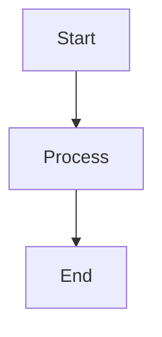

# Development

## Setup

```bash
git clone https://github.com/wayne-nolette/wayne-nolette.git
cd wayne-nolette
npm install
npm run dev
# Open http://localhost:4321/wayne-nolette/
```

Requires Node.js 20+ (see `.nvmrc`).

## Commands

| Command                   | Description                    |
| ------------------------- | ------------------------------ |
| `npm run dev`             | Start dev server               |
| `npm run build`           | Type check + build             |
| `npm run preview`         | Preview production build       |
| `npm run check`           | TypeScript type checking       |
| `npm run lint`            | ESLint                         |
| `npm run lint:fix`        | ESLint with auto-fix           |
| `npm run format`          | Prettier write                 |
| `npm run format:check`    | Prettier check only            |
| `npm run clean`           | Remove dist and .astro folders |
| `npm run test`            | Run Vitest tests               |
| `npm run test:watch`      | Vitest in watch mode           |
| `npm run test:coverage`   | Vitest with coverage           |
| `npm run e2e`             | Run Playwright tests           |
| `npm run e2e:ui`          | Playwright interactive UI      |
| `npm run e2e:headed`      | Playwright in headed mode      |
| `npm run e2e:debug`       | Playwright debug mode          |
| `npm run new:post`        | Create new writing article     |
| `npm run new:case-study`  | Create new case study          |
| `npm run resume:pdf`      | Generate resume PDF            |
| `npm run analyze`         | Build + bundle analysis        |
| `npm run images:optimize` | Optimize images                |

## Adding Content

### Blog Post

1. Create `src/content/writing/my-post.md`
2. Add frontmatter:
   ```yaml
   ---
   title: 'Post Title'
   description: 'Brief description'
   pubDate: 2024-01-15
   tags: ['distributed-systems']
   ---
   ```
3. Write content in Markdown

Or run `npm run new:post`.

### Case Study

1. Create `src/content/case-studies/my-project.md`
2. Add frontmatter:
   ```yaml
   ---
   title: 'Project Title'
   description: 'Brief description'
   order: 5
   role: 'Tech Lead'
   duration: '6 months'
   outcome: '78% cost reduction'
   tech: ['Rust', 'Kubernetes']
   ---
   ```

Or run `npm run new:case-study`.

### ADR

1. Create `src/content/adrs/NNN-title.md`
2. Add frontmatter:
   ```yaml
   ---
   title: 'ADR Title'
   description: 'Brief description'
   pubDate: 2024-01-15
   status: accepted
   deciders: ['Wayne Nolette']
   ---
   ```

## Working with Styles

### CSS Structure

- `src/styles/global.css` — Design tokens, base styles, utilities
- `src/styles/components.css` — Shared button styles, layouts
- `src/styles/fonts.css` — Self-hosted font definitions

### Adding New Styles

Page-specific styles go in `<style>` blocks within `.astro` files. For shared styles, add to `components.css`.

### Design Tokens

Use CSS variables for consistency:

```css
color: var(--color-text);
padding: var(--spacing-md);
border-radius: var(--radius-lg);
```

## Working with Mermaid Diagrams

Add diagrams in Markdown with fenced code blocks:

````markdown

````

Diagrams render with zoom/pan controls automatically.

## Deployment

Automatic on push to `main` via GitHub Actions. Site deploys to:
https://wayne-nolette.github.io/wayne-nolette/

### Manual Deploy

```bash
npm run build
# dist/ folder contains static site
```

## Troubleshooting

**Port 4321 in use:**

```bash
lsof -i :4321
kill -9 <PID>
```

**Content not updating:**

```bash
npm run clean && npm run dev
```

**Fonts not loading locally:**

Fonts are self-hosted at `/wayne-nolette/fonts/`. The base path is required for GitHub Pages deployment.

**Mermaid diagrams not rendering:**

- Check browser console for errors
- Ensure code block uses `mermaid` language identifier
- Diagrams load asynchronously; wait for page to fully load
